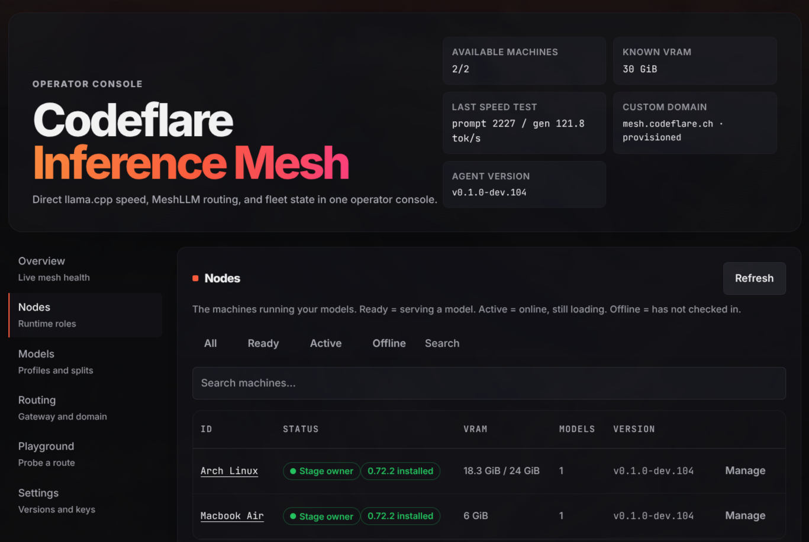
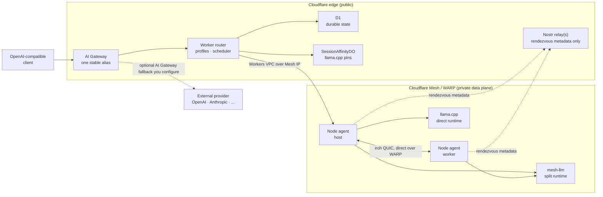
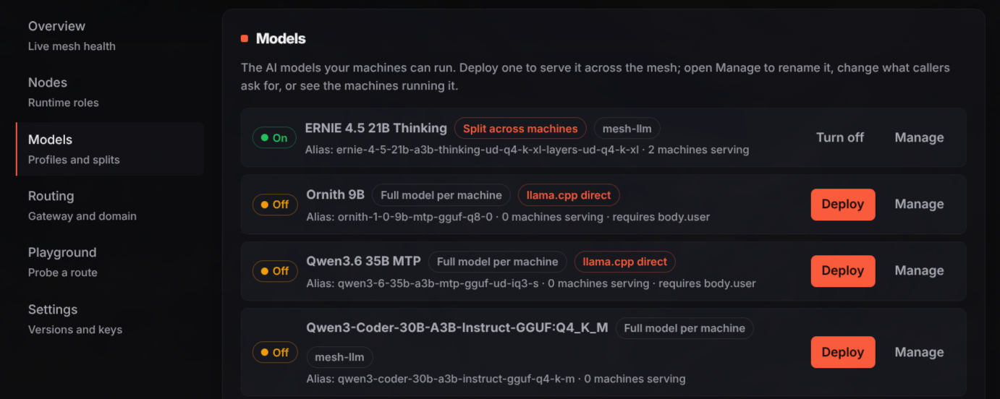

# Codeflare Inference Mesh

  

**Turn the idle machines you already own into a private, cache-aware inference fabric for open LLMs.**

Codeflare Inference Mesh is the self-hosted inference layer of the **[Codeflare](https://codeflare.ch)** family ([GitHub](https://github.com/nikolanovoselec/codeflare)), the agentic engine. It pools the idle GPUs and CPUs already sitting in your fleet into one private fabric and serves open models on it through two runtimes: [mesh-llm](https://github.com/Mesh-LLM/mesh-llm) for multi-machine split models, and direct [llama.cpp](https://github.com/ggml-org/llama.cpp) for cache-local single-node serving. It is the inference engine behind your agentic coding and operations agents, autonomous execution agents, internal chatbots, and anything else in the organization that needs low-latency private inference without shipping prompts to a hosted model by default.

  

---

## Why it exists

Most enterprises already own thousands of Windows, macOS, and Linux devices. They sit idle for most of the working day: someone reads a wiki, sits in a meeting, or waits between tasks while a capable GPU does nothing. Buying dedicated inference racks to sit next to that idle capacity is the expensive way to solve the problem.

The fabric pools the capacity you have. A request lands on one stable Gateway route, the router resolves the active model profile, and the node serves the model locally. For layer packages and models that need more VRAM than one machine has, mesh-llm shards the model across participating nodes. For models that fit on one node, direct llama.cpp keeps coding sessions pinned to the same cache-warm node so long prompts can reuse prefix KV instead of re-prefilling the whole conversation every turn. When local capacity runs short or a task needs a stronger model, you can extend the same route with a native AI Gateway fallback chain to a hosted provider you configure directly in AI Gateway; the router itself does not automate that fallback. No node exposes a public URL, and no prompt leaves your network unless you route it out on purpose.

## How it works

- Clients call one private model alias called `codeflare-mesh`, and the Gateway route stays fixed as nodes come and go.
- The Worker is the only public inference surface. It takes Gateway traffic, resolves the active profile from D1, and forwards over Workers VPC to private Mesh IPs on Cloudflare WARP.
- Model profiles choose the runtime. `meshllm` profiles use stateless entry-node selection because mesh-llm owns dispatch inside the runtime mesh; `llamacpp` profiles use session affinity so follow-up requests for the same coding session return to the same node and keep prefix cache hot.
- Each node runs one Go agent. It installs and supervises the selected, checksum-verified runtime binaries, reports GPU/runtime/mesh health on every heartbeat, and proxies only the OpenAI-compatible inference path to the local runtime.
- Nodes serving a mesh-llm profile form a private runtime mesh. The router elects a seed and hands out encrypted join material through authenticated heartbeats; mesh secrets are encrypted at rest and rotate on one click.

## Runtime modes

**mesh-llm mode** is for split models and layer packages. The node agent launches `mesh-llm serve` with a deterministic private mesh name, WARP bind address, model profile config, runtime tunables, and optional layer splitting; mesh-llm then places stages across the ready participants and exposes the model as one OpenAI-compatible endpoint. The dashboard surfaces mesh role, peer count, ready models, stage ownership, split-readiness blockers, VRAM budgets, runtime version, and the current runtime stderr detail so operators can see whether a model is downloading, loading, waiting for peers, serving, or capacity-blocked.

**Direct llama.cpp mode** is for non-layered models that fit on a single node and need predictable coding-session cache reuse. The node agent launches `llama-server` directly with profile-owned context, parallel lanes, KV cache type, prompt cache, cache reuse, flash-attention, batch, GPU-layer, max-output, and reasoning settings. The router requires a stable session component, preferably `body.user` formatted as `user:<id>|session:<id>`, hashes it with `SESSION_AFFINITY_KEY`, stores only HMAC-derived keys in D1, and uses `SessionAffinityDO` to pin that session to a healthy llama.cpp node until failover is required.

Layered models always use mesh-llm. Non-layered custom models can run either through mesh-llm or direct llama.cpp, so operators can choose between split-capable mesh behavior and single-node cache-local behavior per model.

  

## Private mesh transport

Split serving uses [iroh](https://github.com/n0-computer/iroh) as the private runtime data plane between nodes. Codeflare binds mesh-llm to the node's Cloudflare Mesh IP and starts it with iroh relays disabled, so stage traffic goes direct peer-to-peer over WARP instead of through a public relay. iroh gives mesh-llm an encrypted QUIC transport for the model pipeline, while Cloudflare Mesh provides the bidirectional L3/L4 reachability that makes relay fallback unnecessary. That keeps prompts, activations, and outputs on the operator-controlled private network while still allowing nodes on different physical networks to behave like one inference fabric.

Peer discovery uses [Nostr](https://github.com/nostr-protocol/nostr) only as rendezvous metadata. With no `nostrRelays` configured, mesh-llm uses its built-in public relay defaults; operators that need private rendezvous set `nostrRelays` in the node config, which renders one `--nostr-relay` flag per URL. Relays carry peer identity and WARP Mesh addresses only; iroh data stays direct over WARP via `--bind-ip` and `--disable-iroh-relays`.

Cloudflare Mesh is the backbone for connectivity, routing, inference guardrails, and the control plane. AI Gateway gives clients one stable enterprise route, Workers enforce provider authentication and request limits, D1 and Durable Objects hold durable scheduling and affinity state, Access protects the operator console, and WARP gives every node a private address the Worker and peer nodes can reach. The result is a native Cloudflare deployment: public edge where you want policy, private Mesh where you want inference, and no third-party infrastructure in the data path.

## What it runs

The fabric serves open models, not a fixed menu. mesh-llm profiles can run regular GGUF model references and published layer packages, splitting a model across several nodes when one machine is not enough. Direct llama.cpp profiles run Hugging Face GGUF models through `llama-server` when the model fits on one node and the priority is maximum prefix-cache reuse for long agentic coding sessions. Operators publish whichever model is active under the stable alias `codeflare-mesh`; the fabric rewrites the request to the concrete upstream model only after the Gateway route has stayed stable.

## Quickstart

1. Fork this repository and add the required deploy secrets in GitHub Actions.
2. Run the Deploy workflow, `integration` first, then `production`.
3. Enroll your nodes in Cloudflare One / WARP. The agent pulls the runtime it needs, `mesh-llm` for mesh profiles or `llama-server` for direct llama.cpp profiles, so there is no separate server to stand up.
4. Open the deployed origin and follow the setup wizard through custom domain, Access, Gateway, and your first node.

The steps below link to the private operations reference for exact secrets, token scopes, and bindings, then cover the public node runbook.

<strong>Fork &amp; prerequisites</strong>

You need a Cloudflare account and a GitHub repository. Everything builds and deploys in GitHub Actions; nothing runs on your laptop.

- A Cloudflare account with Workers, D1, and AI Gateway available.
- A zone in that account if you want a custom domain (recommended; the console requires one for Access).
- Cloudflare One / WARP for private node reachability.
- Each node: a GPU with current drivers where applicable, and outbound HTTPS to `github.com` and `huggingface.co`.

<strong>Deploy secrets &amp; token scopes</strong>

The deploy secret list, Cloudflare token scopes, and GitHub Actions variable inventory are maintained in the private operations repository:

https://github.com/nikolanovoselec/codeflare-inference-mesh-private

When deployment secrets, token scopes, or Actions variables change, update that private README as the source of truth. This public README intentionally does not duplicate the operational matrix.

Deploy tags: `vX.Y.Z-dev.N` for integration, `vX.Y.Z` for production.

<strong>Worker bindings, vars &amp; runtime secrets</strong>

The Worker configuration lives in [`packages/router-worker/wrangler.toml`](packages/router-worker/wrangler.toml). The exact binding inventory, runtime secrets, deployment variables, and node environment reference are maintained in the private operations repository:

https://github.com/nikolanovoselec/codeflare-inference-mesh-private

This public README intentionally does not duplicate the operational matrix.

<strong>Node enrollment, mesh formation &amp; self-update</strong>

1. Enroll each node in Cloudflare One / WARP so the Worker can reach it privately.
2. From the console, mint a single-use enrollment token and copy the generated one-line installer.
3. Run it on the node. The agent claims against the router, installs the selected runtime binary, opens its private listener on the WARP address, and starts heartbeating.
4. For mesh-llm profiles, the first node for a profile becomes the mesh seed; later nodes receive join tokens through heartbeats and join automatically, so you never handle a token by hand.
5. For direct llama.cpp profiles, deploy the same active profile to the nodes that should serve it; the router pins each `body.user` session to one healthy node and fails over only when that node stops being eligible.
6. Watch health in the console: runtime kind, installed runtime versions, GPU memory, ready models, stage assignments for split models, and cache/slot details for direct llama.cpp models.

Self-update works the same way. Pick a release tag from the console's agent-version dropdown, and every node converges to it, newer or older, by downloading the tagged binary, verifying its SHA-256, swapping atomically, and letting the service manager restart it. A failed update leaves the running version in place and reports the error.

The full two-node runbook, rotation and failover tests, and rollback live in [deployment.md](documentation/lanes/deployment.md).

## Documentation

- [Product requirements](sdd/): the source-of-truth spec, with source and test anchors on every behavior.
- [Operational docs](documentation/): architecture, configuration, security, deployment, and troubleshooting.
- [Security policy](SECURITY.md) · [Contributing](CONTRIBUTING.md) · [License](LICENSE)
