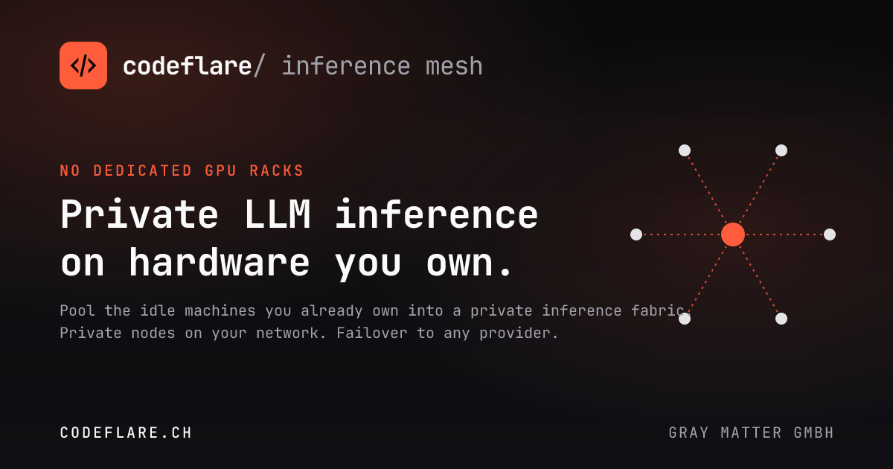
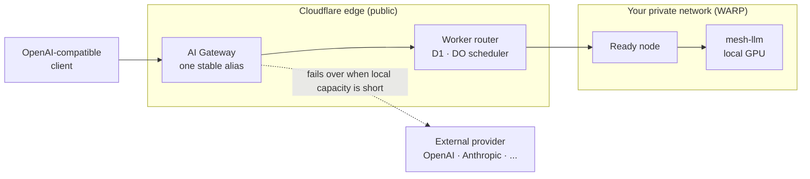

# Codeflare Inference Mesh

  

**Private LLM inference on the machines you already own, behind one OpenAI-compatible endpoint.**

Codeflare Inference Mesh is the self-hosted inference layer of the **Codeflare** family, the enterprise agentic coding engine. It gives Codeflare's agents, and any OpenAI-compatible client you already run, a private model backend that lives inside your own network instead of a third-party API.

---

## Why it exists

Most enterprises already own thousands of Windows, macOS, and Linux devices. They sit idle for most of the working day: someone reads a wiki, sits in a meeting, or waits between tasks while a capable GPU does nothing. Buying dedicated inference racks to sit next to that idle capacity is the expensive way to solve the problem.

The mesh pools the capacity you have. A request lands on one stable Gateway route, the router picks a ready node, and the node serves the model locally. When local capacity runs short or a task needs a stronger model, the same route fails over to OpenAI, Anthropic, Microsoft, or any other provider you configure. No node exposes a public URL, and no prompt leaves your network unless you route it out on purpose.

## How it works

- Clients call one public model alias such as `mesh-default`, and the Gateway route stays fixed as nodes come and go.
- The Worker is the only public surface. It takes Gateway traffic, reserves a ready node through a Durable Object scheduler, and forwards over Workers VPC to nodes that stay private on Cloudflare WARP.
- Each node runs one Go agent. It installs and supervises a pinned, checksum-verified `mesh-llm` binary, reports health on every heartbeat, and proxies requests to it, so there is no separate inference server to babysit.
- Nodes serving the same profile form a private mesh. The router elects a seed and hands out join tokens through heartbeats; the mesh then serves a model on one node or splits it across several. Mesh secrets are encrypted at rest and rotate on one click.

## The operator console

Setup and day-two operations run from the browser. The console is gated by Cloudflare Access on your own custom domain, so there is no long-lived admin password to leak.

- The wizard runs on the bootstrap origin: claim the deployment, provision the custom domain, then provision Access. It hands off to the custom domain for Gateway connection, first-node enrollment, and review, and afterward the bootstrap origin locks itself to a "moved" page.
- Roles come from Access. You name admin and user identities (Access groups or emails) at setup or later. Admins see and change everything; read-only users get the dashboard and the playground and nothing they can break. Leave the user set empty and anyone who clears Access gets read-only access.
- The dashboard shows the live mesh: a hub-and-spoke topology, per-node and per-model drawers, a stats strip, a sortable node table, and a tokens-per-second trace that refreshes every five seconds.
- The playground sends a prompt through the real Gateway route and streams it back, without ever pasting a key into a browser.

One manual step lives inside the wizard: the Gateway step reveals a provider key to paste into the AI Gateway custom provider's BYOK field, and re-syncing the Gateway rotates it. That key is what lets the route fail over to your configured provider.

## Quickstart

1. Fork this repository and add the four deploy secrets in GitHub Actions.
2. Run the Deploy workflow, `integration` first, then `production`.
3. Enroll your nodes in Cloudflare One / WARP. The agent pulls its own `mesh-llm`, so there is no separate server to stand up.
4. Open the deployed origin and follow the setup wizard through custom domain, Access, Gateway, and your first node.

The steps below expand into exact secrets, token scopes, bindings, and the node runbook.

<strong>Fork &amp; prerequisites</strong>

You need a Cloudflare account and a GitHub repository. Everything builds and deploys in GitHub Actions; nothing runs on your laptop.

- A Cloudflare account with Workers, D1, and AI Gateway available.
- A zone in that account if you want a custom domain (recommended; the console requires one for Access).
- Cloudflare One / WARP for private node reachability.
- Each node: a GPU with current drivers where applicable, and outbound HTTPS to `github.com` and `huggingface.co`.

<strong>Deploy secrets &amp; token scopes</strong>

Set these in **Settings → Secrets and variables → Actions**. Use scoped API tokens, never a global key.

| Secret | Required | Purpose |
| --- | --- | --- |
| `CLOUDFLARE_ACCOUNT_ID` | Yes | Cloudflare account used by deploy and runtime setup. |
| `CLOUDFLARE_API_TOKEN_DEPLOY` | Yes | Deploys Workers and manages D1. |
| `CLOUDFLARE_API_TOKEN_RUNTIME` | Yes | Lets the deployed Worker sync AI Gateway and provision custom domains and Access. |
| `MESH_STATE_KEY` | Yes | Encrypts stored private-mesh state; the deploy fails closed without it. |
| `ADMIN_RECOVERY_TOKEN` | Optional | Emergency recovery for a lost admin session. |
| `COSIGN_PRIVATE_KEY` / `COSIGN_PASSWORD` | Optional | Signs release checksums. |

**Token scopes**

| Token | Minimum scopes |
| --- | --- |
| `CLOUDFLARE_API_TOKEN_DEPLOY` | `Workers Scripts: Edit`, `D1: Edit`, `Account Settings: Read` |
| `CLOUDFLARE_API_TOKEN_RUNTIME` | `AI Gateway: Edit`, `Access: Apps and Policies Edit`, `Access: Organizations, Identity Providers, and Groups Edit`, `Account Settings: Read`; add `Workers Routes: Edit` and target-zone DNS permissions for custom-domain provisioning |

Do not store the provider, admin, setup, node, or upstream tokens as GitHub secrets. First-run setup mints those, and each surfaces only where it is used.

Deploy tags: `vX.Y.Z-dev.N` for integration, `vX.Y.Z` for production.

<strong>Worker bindings, vars &amp; runtime secrets</strong>

The Worker configuration lives in [`packages/router-worker/wrangler.toml`](packages/router-worker/wrangler.toml).

| Name | Type | Purpose |
| --- | --- | --- |
| `DB` | D1 binding | Durable router state. |
| `REGISTRY` | Durable Object | Serialized scheduling and reservation release. |
| `MESH` | Workers VPC Network | Worker-to-private-node `fetch()` path; ships commented and is enabled by the deploy workflow (see [configuration.md](documentation/lanes/configuration.md)). |
| `MAX_REQUEST_BYTES` | Var | Chat request size limit. |
| `HEARTBEAT_TTL_SECONDS` | Var | Node freshness window. |
| `AI_GATEWAY_ID` / `AI_GATEWAY_ROUTE_NAME` / `AI_GATEWAY_PROVIDER_NAME` / `AI_GATEWAY_PUBLIC_MODEL` | Var | Gateway defaults for the setup wizard. |
| `WORKER_NAME` | Var | Worker script name for custom-domain routes and managed Access groups. |
| `WORKER_BASE_URL` | Var | Optional bootstrap-origin override; setup uses the request origin when unset. |
| `AGENT_RELEASE_TAG` | Var | Release tag the installers pull. |
| `CLOUDFLARE_ACCOUNT_ID` / `CLOUDFLARE_API_TOKEN_RUNTIME` | Secret | Runtime Cloudflare account and token. |
| `MESH_STATE_KEY` | Secret | Mesh state encryption key; bootstrap and rotation refuse to run without it. |
| `ADMIN_RECOVERY_TOKEN` | Secret | Optional admin-recovery secret. |
| `SETUP_REOPEN` | Secret | Optional break-glass secret to reopen setup on a locked bootstrap origin. |

**Node environment**

| Name | Required | Purpose |
| --- | --- | --- |
| `HF_TOKEN` | Only for gated Hugging Face profiles | Passed through the node service environment to `mesh-llm`. |

<strong>Node enrollment, mesh formation &amp; self-update</strong>

1. Enroll each node in Cloudflare One / WARP so the Worker can reach it privately.
2. From the console, mint a single-use enrollment token and copy the generated one-line installer.
3. Run it on the node. The agent installs `mesh-llm`, claims against the router, and starts heartbeating.
4. The first node for a profile becomes the mesh seed; later nodes receive join tokens through heartbeats and join automatically, so you never handle a token by hand.
5. Watch mesh health in the console: seed and coordinator assigned, every node listed as a peer, and the active model in `readyModels`.

Self-update works the same way. Pick a release tag from the console's agent-version dropdown, and every node converges to it, newer or older, by downloading the tagged binary, verifying its SHA-256, swapping atomically, and letting the service manager restart it. A failed update leaves the running version in place and reports the error.

The full two-node runbook, rotation and failover tests, and rollback live in [deployment.md](documentation/lanes/deployment.md).

## Built to be verified

Every change proves itself in CI before it ships: router and Go test suites, type checks, release packaging, security scanning, fuzzing, and workflow-safety validation. The required checks (`test`, `security`, `fuzz`) gate branch protection, and production deploys refuse to run unless `main` is green. The container the mesh is developed in is deliberately constrained, so CI, not a laptop, is the source of truth.

## Documentation

- [Product requirements](sdd/): the source-of-truth spec, with source and test anchors on every behavior.
- [Operational docs](documentation/): architecture, configuration, security, deployment, and troubleshooting.
- [Security policy](SECURITY.md) · [Contributing](CONTRIBUTING.md) · [License](LICENSE)
